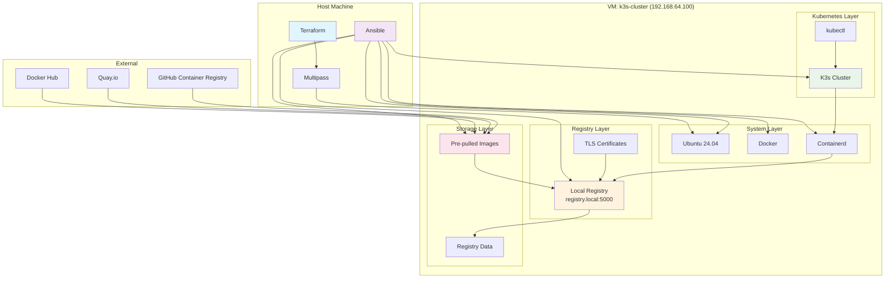
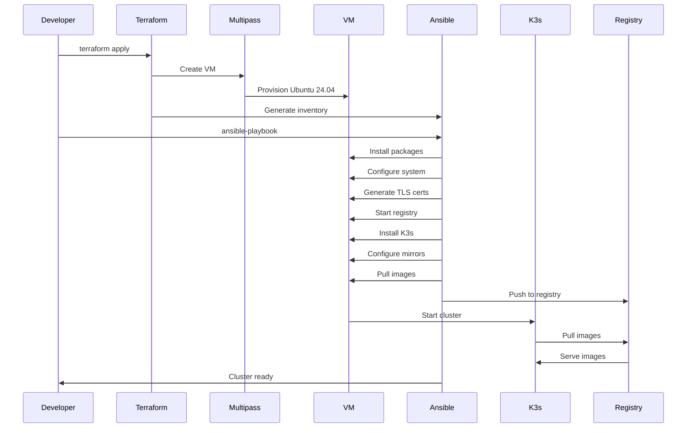
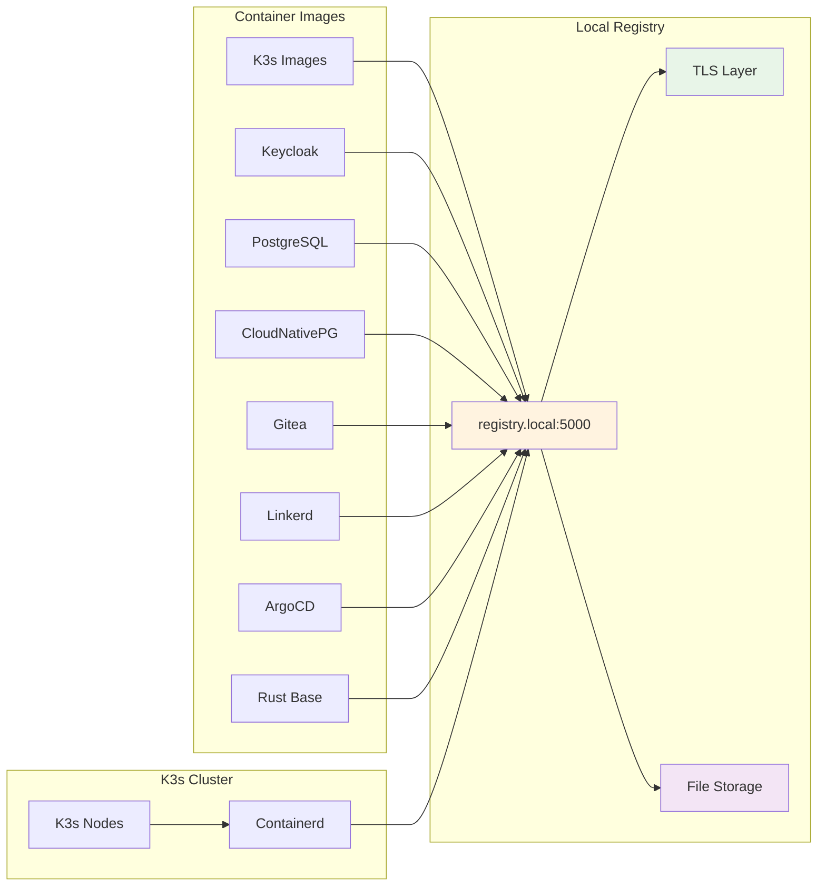
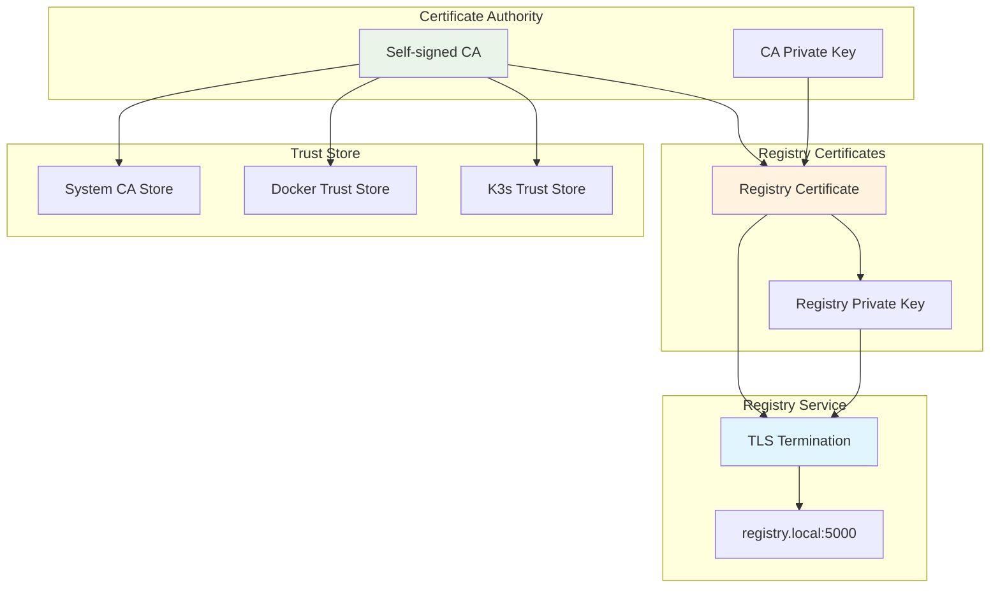

# Architecture Overview

## Task 1: Cluster Infrastructure

```mermaid
graph TB
    subgraph "Host Machine"
        T[Terraform]
        A[Ansible]
        M[Multipass]
    end

    subgraph "VM: k3s-cluster (192.168.64.100)"
        subgraph "System Layer"
            OS[Ubuntu 24.04]
            D[Docker]
            C[Containerd]
        end

        subgraph "Kubernetes Layer"
            K3S[K3s Cluster]
            KUBECTL[kubectl]
        end

        subgraph "Registry Layer"
            REG[Local Registry<br/>registry.local:5000]
            TLS[TLS Certificates]
        end

        subgraph "Storage Layer"
            IMG[Pre-pulled Images]
            DATA[Registry Data]
        end
    end

    subgraph "External"
        DOCKER[Docker Hub]
        QUAY[Quay.io]
        GHCR[GitHub Container Registry]
    end

    T --> M
    M --> OS
    A --> OS
    A --> D
    A --> C
    A --> K3S
    A --> REG
    A --> IMG

    DOCKER --> IMG
    QUAY --> IMG
    GHCR --> IMG

    IMG --> REG
    REG --> DATA
    TLS --> REG

    C --> REG
    K3S --> C
    KUBECTL --> K3S

    style T fill:#e1f5fe
    style A fill:#f3e5f5
    style K3S fill:#e8f5e8
    style REG fill:#fff3e0
    style IMG fill:#fce4ec
```

## Infrastructure Flow

```mermaid
sequenceDiagram
    participant Dev as Developer
    participant T as Terraform
    participant M as Multipass
    participant VM as VM
    participant A as Ansible
    participant K3S as K3s
    participant REG as Registry

    Dev->>T: terraform apply
    T->>M: Create VM
    M->>VM: Provision Ubuntu 24.04
    T->>A: Generate inventory

    Dev->>A: ansible-playbook
    A->>VM: Install packages
    A->>VM: Configure system
    A->>VM: Generate TLS certs
    A->>VM: Start registry
    A->>VM: Install K3s
    A->>VM: Configure mirrors
    A->>VM: Pull images
    A->>REG: Push to registry

    VM->>K3S: Start cluster
    K3S->>REG: Pull images
    REG->>K3S: Serve images

    A->>Dev: Cluster ready
```

## Registry Architecture

```mermaid
graph LR
    subgraph "Container Images"
        K3S_IMG[K3s Images]
        KEYCLOAK[Keycloak]
        POSTGRES[PostgreSQL]
        CNPG[CloudNativePG]
        GITEA[Gitea]
        LINKERD[Linkerd]
        ARGOCD[ArgoCD]
        RUST[Rust Base]
    end

    subgraph "Local Registry"
        REG[registry.local:5000]
        TLS[TLS Layer]
        STORAGE[File Storage]
    end

    subgraph "K3s Cluster"
        CONTAINERD[Containerd]
        K3S[K3s Nodes]
    end

    K3S_IMG --> REG
    KEYCLOAK --> REG
    POSTGRES --> REG
    CNPG --> REG
    GITEA --> REG
    LINKERD --> REG
    ARGOCD --> REG
    RUST --> REG

    REG --> TLS
    REG --> STORAGE

    CONTAINERD --> REG
    K3S --> CONTAINERD

    style REG fill:#fff3e0
    style TLS fill:#e8f5e8
    style STORAGE fill:#f3e5f5
```

## Security Model

```mermaid
graph TB
    subgraph "Certificate Authority"
        CA[Self-signed CA]
        CA_KEY[CA Private Key]
    end

    subgraph "Registry Certificates"
        REG_CERT[Registry Certificate]
        REG_KEY[Registry Private Key]
    end

    subgraph "Trust Store"
        SYSTEM[System CA Store]
        DOCKER[Docker Trust Store]
        K3S[K3s Trust Store]
    end

    subgraph "Registry Service"
        REG[registry.local:5000]
        TLS[TLS Termination]
    end

    CA --> REG_CERT
    CA_KEY --> REG_CERT
    REG_CERT --> REG_KEY

    CA --> SYSTEM
    CA --> DOCKER
    CA --> K3S

    REG_CERT --> TLS
    REG_KEY --> TLS
    TLS --> REG

    style CA fill:#e8f5e8
    style REG_CERT fill:#fff3e0
    style TLS fill:#e1f5fe
```

